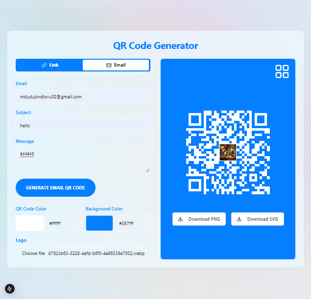

# QR Code Generator

## Introduction

This project is a simple yet powerful QR Code Generator built with React. The goal of this project is to provide a user-friendly tool that can generate customized QR codes for different types of content, such as URLs and email links. I created this project to solve the need for a tool that allows easy generation of QR codes with customizable features, such as colors, logos, and the ability to download the generated codes in various formats (PNG and SVG). Whether you're creating QR codes for personal, business, or marketing use, this tool can help streamline the process.



## Features

- **Generate QR Codes for Links and Email**: 
  - For links, input a URL, and the QR code will be generated.
  - For email, input an email address, subject, and message, and the QR code will generate a "mailto" link.

- **Customization Options**: 
  - **Color**: Adjust the color of the QR code.
  - **Background Color**: Change the background color of the QR code.
  - **Logo**: Upload a logo to be embedded in the center of the QR code.
  
- **Download Options**: 
  - **PNG**: Download the QR code as a PNG image.
  - **SVG**: Download the QR code as an SVG file.

- **Responsive Layout**: Designed with a responsive user interface to work well across different devices.

## Tech Stack

- **Frontend**: React
- **QR Code Generation**: `qrcode.react` library
- **File Handling**: `html-to-image` and `file-saver` libraries for downloading images
- **UI Components**: Custom components built with Tailwind CSS for styling

## Setup

To run this project locally, follow these steps:

1. **Clone the repository:**
   ```bash
   git clone https://github.com/your-username/qr-code-generator.git

2. **Install dependencies: Navigate into the project directory and install the required dependencies:**
   ```bash
   cd qr-code-generator
    npm install
3. **Install dependencies: Navigate into the project directory and install the required dependencies:**
   ```bash
   npm start

4. **Open your browser and visit http://localhost:3000 to see the app in action.**

## How It Works

### Select QR Code Type:
- Choose between "Link" or "Email" using the tabs at the top of the app.

### Input Information:
- For the "Link" tab, enter a URL to generate a link-based QR code.
- For the "Email" tab, provide an email address, subject, and message to generate an email-based QR code.

### Customize QR Code:
- Change the QR code's color and background color using the color pickers.
- Optionally, upload a logo to be embedded in the QR code.

### Download:
- Once the QR code is generated, use the "Download PNG" or "Download SVG" buttons to save the QR code.

## Future Improvements
- Support for additional QR code types (e.g., phone numbers, Wi-Fi networks).
- Improve the user interface with more customization options.
- Add an option to preview the QR code before downloading.

## License
This project is open-source and available under the [MIT License](LICENSE).

## Acknowledgments
- Thanks to [React](https://reactjs.org/) for the powerful JavaScript library.
- Thanks to the libraries `qrcode.react`, `html-to-image`, and `file-saver` for making QR code generation and downloading easier.


